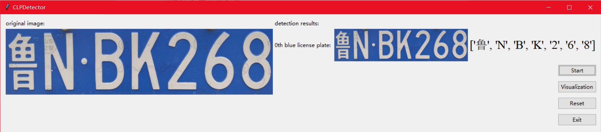

# CLPDetector
A color-shape and shape-color two pipelines based Chinese License Plates Detector.
Aim at both taking the efficient advantages of traditional handcraft features extraction computer vision algorithms to make up for deep learning based algorithms, and making use of multiple priori features instead of single feature to improve the robustness and accuracy of the detection algorithm.

Task:


CLPDetector pipeline:


## Support Features
* Color-based RoI proposal and shape-based RoI proposal
* Shape-based plate rectification and color-based plate rectification
* Wave-based characters split
* SVM-based characters classification
* Two pipelines parallel threading
* Easy to use GUI

## Get Started
```bash
# install dependencies
pip install -r requirements.txt

# train the SVM models
python classifier.py

# test all images together
python detector.py

# run the GUI CLPDetector
python main.py
```

## Demo


## Results
* Classifier Result


* Detector Result


* Detection Test Result





* Visualization Result


## Structures
* Color-based RoI Proposal


* Shape-based RoI Proposal


* Color-based Rectification


* Shape-based Rectification


* Wave-based Characters Split


* SVM-based Characters Classification


## TODO List
- [x] core detection algorithms implementation
  - [x] color-based ROI proposal
  - [x] shape-based ROI proposal
  - [x] rectification for ROIs from color proposal
  - [x] rectification for ROIs from shape proposal
  - [x] characters split
  - [x] characters classification
  - [x] characters classifier models training
- [x] core detection algorithms refactor (`detector.py - ChineseLicensePlateDetector`)
  - [x] detect wrapper (`detect()`)
    - [x] color shape pipeline (`color_shape_pipeline()`)
      - [x] preprocess (`color_shape_preprocess()`)
      - [x] color RoI proposal (`color_RoI_proposal()`)
      - [x] shape rectification (`shape_rectification()`)
      - [x] characters split (`color_shape_characters_preprocess()`)
      - [x] characters classification (`characters_classify()`, `classifier.py`)
    - [x] shape color pipeline (`shape_color_pipeline()`)
      - [x] preprocess (`shape_color_preprocess()`)
      - [x] shape RoI proposal (`shape_RoI_proposal()`)
      - [x] color rectification (`color_rectification()`)
      - [x] characters split (`shape_color_characters_preprocess()`)
      - [x] characters classification (`characters_classify()`, `classifier.py`)
- [x] GUI design
  - [x] main window (original image, detection results)
  - [x] visualization window (two pipelines intermediate results show)
